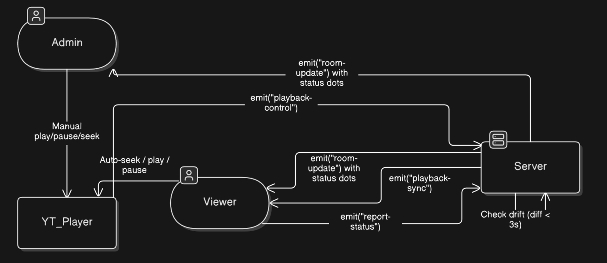

# YouTube Co-Watch

A real-time co-watching platform that allows synchronized YouTube video playback and interactive group chat. The system features latency compensation, active synchronization diagnostics, administrative control structures, and a premium dark-themed user interface.

## Architecture Flowchart



## Technologies Used


---

## Key Features

*   **Real-time Playback Synchronization**: Simultaneous video play, pause, and seek events across all viewers in a room.
*   **Latency-Compensated Time Alignment**: Epoch-time offset logic automatically positions joining or buffering users to the exact playback frame of the active room.
*   **Active Sync Diagnostics**: Clients report status (timestamp, state) periodically, and the server computes synchronization health to show real-time green/red connection badges for active viewers.
*   **Role-Based Authority (Admin Controls)**: The room creator acts as the administrator with exclusive playback control (via standard player timeline/bar). Joined members are locked to watch-only mode with custom overlay restrictions.
*   **Integrated Group Chat**: Seamless real-time chat updates to communicate during video sessions, including system notification events.

---

## Installation & Setup

### Prerequisites
*   Node.js (v18+)
*   npm or yarn

### 1. Backend Setup
1. Navigate to the backend directory:
   ```bash
   cd backend
   ```
2. Install dependencies:
   ```bash
   npm install
   ```
3. Configure environment variables. Create a `.env` file:
   ```env
   PORT=5000
   FRONTEND_URL=http://localhost:5173
   ```
4. Start the development server:
   ```bash
   npm run dev
   ```

### 2. Frontend Setup
1. Navigate to the frontend directory:
   ```bash
   cd ../frontend
   ```
2. Install dependencies:
   ```bash
   npm install
   ```
3. Configure environment variables. Create a `.env` file:
   ```env
   VITE_BACKEND_URL=http://localhost:5000
   ```
4. Start the development server:
   ```bash
   npm run dev
   ```

